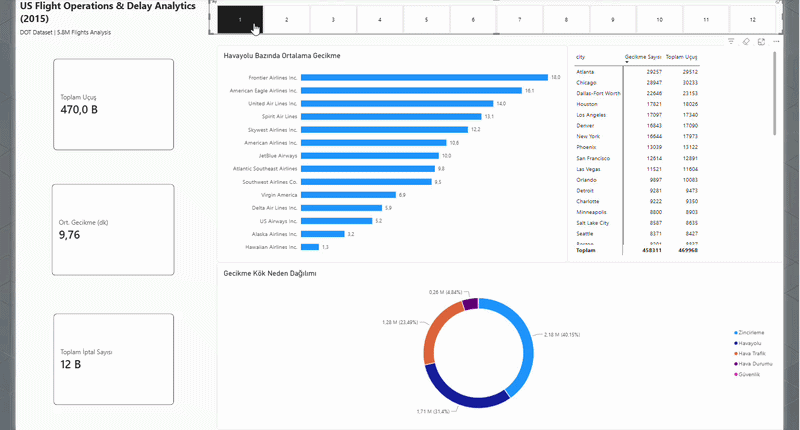
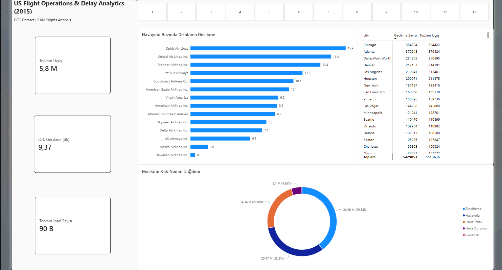
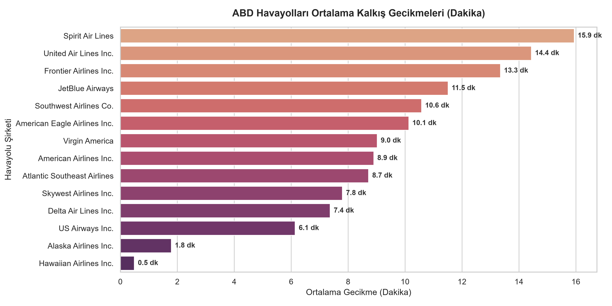
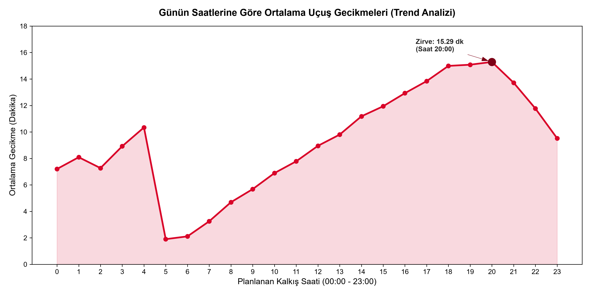
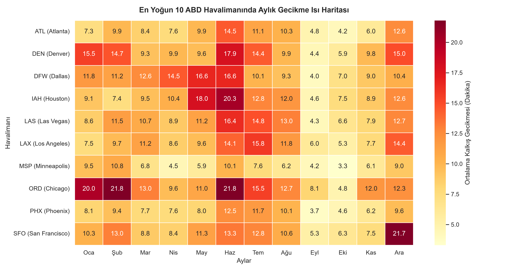

<div align="center">

<!-- Animasyonlu Daktilo Başlık -->
<a href="https://git.io/typing-svg">
  
</a>

<br/>

<!-- Teknoloji Rozetleri -->
<p align="center">
  
  
  
  
  
</p>

### ⚡ 5.81M+ Uçuş | 14 Taşıyıcı Şirket | 322 Havalimanı | Uçtan Uca BI Hattı

<br/>

<!-- Power BI Dashboard İndirme Rozeti -->
[](https://drive.google.com/file/d/1_6066DJPM4u3NYr3qTE8BvGhViS-ATva/view?usp=sharing)

</div>

---

## 📌 Yönetici Özeti (Executive Summary)

Bu proje, ABD Ulaştırma İstatistikleri Bürosu'nun (DOT) **5.8 milyondan fazla** ticari uçuş kaydını kapsayan veri tabanını merkeze alarak; veritabanı modellemesi, anomali tespiti, Python tabanlı istatistiksel görselleştirme ve Power BI üzerinde yönetici düzeyinde (Executive Dashboard) interaktif raporlama süreçlerini kapsar.

---

## 🎬 Canlı İnteraktif Dashboard Demosu

> *Aylık dilimleyiciler (slicers) ve çapraz filtreleme (cross-filtering) içeren dinamik kokpit:*

<div align="center">



</div>

<br/>

## 📊 Yönetici Gösterge Paneli (Executive Dashboard)

<div align="center">



</div>

---

## 💡 Öne Çıkan Operasyonel Bulgular

| Alan | Metrik / Oran | Çıkarım |
| :--- | :---: | :--- |
| 🔄 **Zincirleme Gecikmeler (Late Aircraft)** | **%39.84** | En büyük gecikme kaynağı; önceki uçuşun rötarının sonraki bacağa aktarılmasıdır. |
| 🏢 **Taşıyıcı Verimsizlikleri (Carrier Delay)** | **%32.20** | Havayollarının iç operasyonları, yer hizmetleri ve bakım süreçleri 2. sıradadır. |
| ⛈️ **Hava Muhalefeti (Weather Delay)** | **%4.95** | Kamuoyundaki yaygın algının aksine, hava şartları toplam gecikmenin küçük bir kısmıdır. |
| ⏱️ **En Yüksek Rötar Ortalaması** | **15.9 & 14.4 dk** | **Spirit Airlines** ve **United Airlines** en yüksek kalkış gecikmesine sahiptir. |
| ✈️ **En Dakik Şirketler** | **0.5 & 1.8 dk** | **Hawaiian Airlines** ve **Alaska Airlines** operasyonel zamanlamada liderdir. |
| 📍 **Trafik & Gecikme Merkezleri** | **394K & 379K Uçuş** | **Chicago (ORD)** ve **Atlanta (ATL)** yıl boyunca en yoğun iki ana operasyon merkezidir. |

---

## 🔬 Python & Seaborn Derinlemesine Analizleri

| Taşıyıcı Bazında Ortalama Gecikme | Gecikme Nedenlerinin Dağılımı |
| :---: | :---: |
|  |  |

| 24 Saatlik Gecikme Dalgalanması | 12 Aylık Havalimanı Yoğunluk Haritası |
| :---: | :---: |
|  |  |

---

## 🛠️ Veri Temizleme Vakası: "Ekim Ayı Anomalisini Çözme"

Veri doğrulama aşamasında, **Ekim ayı** uçuşlarında standart 3 haneli IATA kodları yerine DOT/FAA 5 basamaklı sayısal kodlarının (`10397`, `13930` vb.) yer aldığı tespit edildi. Bu durum ilişkisel modeli kırdığı için PostgreSQL katmanında standartlaştırıldı:

```sql
-- sql/process_of_analyst.sql
UPDATE flights
SET origin_airport = CASE origin_airport
    WHEN '10397' THEN 'ATL'
    WHEN '13930' THEN 'ORD'
    WHEN '11298' THEN 'DFW'
    WHEN '11292' THEN 'DEN'
    WHEN '12892' THEN 'LAX'
    WHEN '14771' THEN 'SFO'
    WHEN '12266' THEN 'IAH'
    WHEN '14107' THEN 'PHX'
    WHEN '12889' THEN 'LAS'
    WHEN '13487' THEN 'MSP'
    ELSE origin_airport
END
WHERE month = 10;
```
## 🗂️ Proje Dosya Yapısı

```text
├── 📁 assets/
│   ├── airline_delays.png           # Taşıyıcı ortalama gecikme grafiği
│   ├── airport_monthly_heatmap.png  # Havalimanı aylık yoğunluk ısı haritası
│   ├── dashboard_overview.png       # Power BI genel kokpit görünümü
│   ├── demo.gif                     # Etkileşimli filtreleme animasyonu
│   ├── hourly_delay_trend.png       # Gün içi saatlik rötar eğrisi
│   └── root_cause_distribution.png  # Gecikme kök neden dağılım grafiği
├── 📁 python/
│   ├── airport_heatmap.py           # Isı haritası görselleştirme scripti
│   ├── db_connect.py                # PostgreSQL bağlantı köprüsü
│   ├── hourly_delay_chart.py        # Saatlik eğri scripti
│   └── root_cause_chart.py          # Halka grafik kök neden scripti
└── 📁 sql/
    ├── airline_queries.sql          # Havayolu metrik sorguları
    ├── create_tables.sql            # Şema ve tablo tanımları
    ├── FlightsData.sql              # Ana tablo yapılandırması
    └── process_of_analyst.sql       # Anomali düzeltme ve veri işleme adımlarıı
